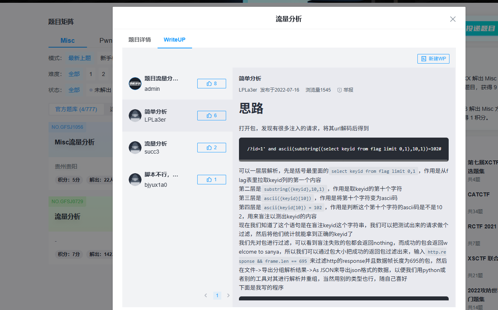
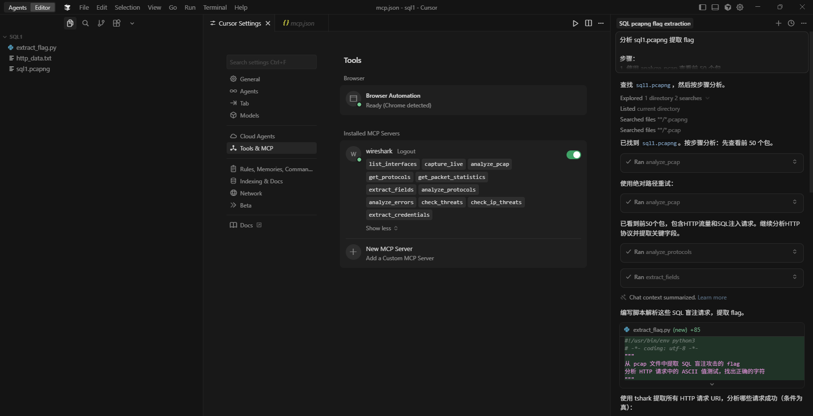
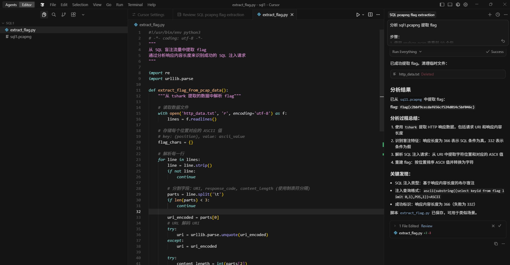

```
分析 xxx.pcapng 提取 flag

步骤：
1. 使用 analyze_pcap 快速查看包信息
2. 根据协议类型，用 analyze_protocols 深入分析
3. 用 extract_fields 提取关键字段
4. 分析数据，编写脚本解码或使用 tshark 深入分析

注意：MCP 工具提供信息，你需要自己灵活分析和决策
```

# SQL流量分析







# USB 流量分析

https://ctf.bugku.com/challenges/detail/id/2416.html

使用 wireshark mco分析flag.pcap，得到flag。


flag{pr355_0nwards_a2fee6e0}
